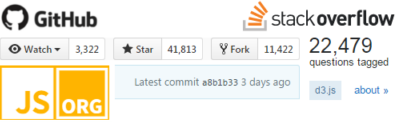
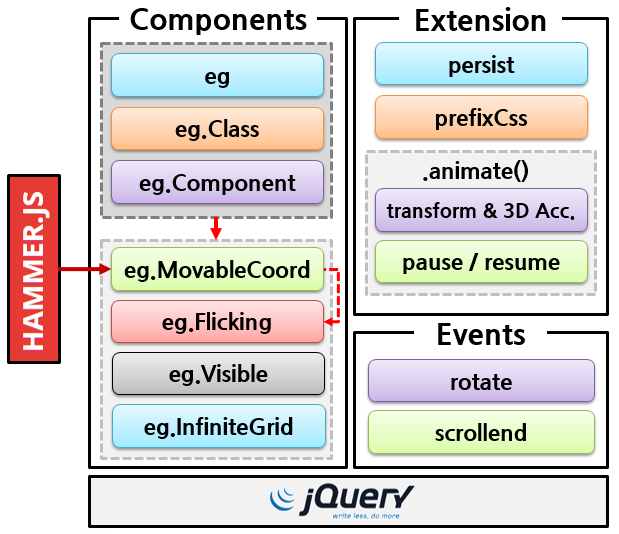
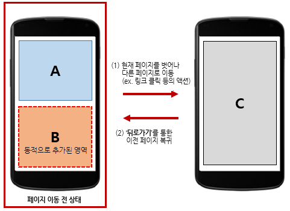
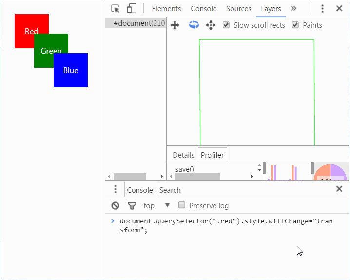
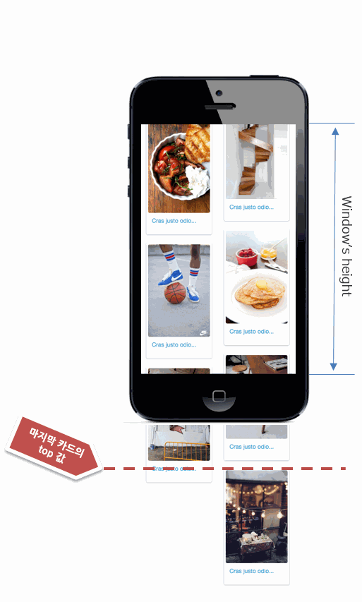
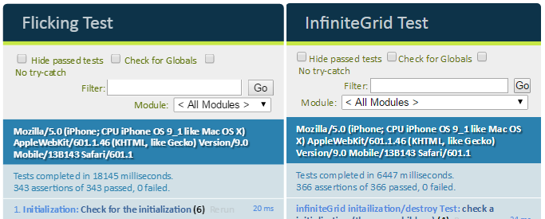
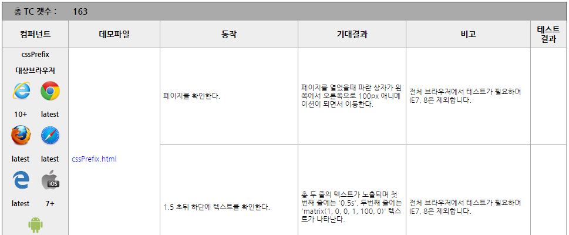

<!-- .slide:data-background="linear-gradient(600deg, rgb(60, 3, 3) 50%, rgb(131, 7, 7) 0px)" -->

    
<h1>프롤로그</h1>

----------

## OOO 기능을 개발해야 하는 상황,
# 어떻게 하시나요?

----------

## 아마도 다음 옵션 중 한가지

# 1) 직접 개발 <!-- .element: class="fragment" -->
# 2) 오픈소스 사용 <!-- .element: class="fragment" -->

----------

#1) 직접 개발
## 다양한 환경에서의 동작 보장 필요

----------

#2) 오픈소스 사용
## 안정성과 검증된 라이브러리를 찾는게 중요

----------

# 잠깐, 오픈소스 검색은 어떻게 하시나요?

----------

# 너 믿고 쓸만하니?

<ul class="size40">
    <li class="fragment">github 지표들 (star, fork, watch)</li>
    <li class="fragment">인기도 - https://stats.js.org/</li>
    <li class="fragment">stackoverflow 게시글(질문/답변) 수</li>
    <li class="fragment">마지막 commit 날짜</li>
    <li class="fragment">충분한 레퍼런스 문서 여부</li>
    <li class="fragment">기타 등등...</li>
</ul>

----------

# 비용과 안정성 고려시 오픈소스 사용이 현실적 방법

----------

&nbsp;

> egjs는 주요 웹 UI/UX 개발을 돕는 UI 인터랙션, 이펙트,
> 유틸리티로 구성된 자바스크립트 라이브러리

- 5개의 컴포넌트 <!-- .element: class="fragment size40" -->
- 4개의 jQuery 확장 플러그인 <!-- .element: class="fragment size40" -->
- 2개의 커스텀 이벤트 <!-- .element: class="fragment size40" -->

----------

## egjs architecture

----------

## 주요 구성요소

| 컴포넌트 <!-- .element: style="font-size:30px" --> | | 
| --- | --- |
| eg | 유틸리티 모음 |
| MovableCoord | 사용자의 동작을 가상 좌표계의 논리적 좌표로 변경 |
| Flicking | 플리킹 UI를 구현 |
| infiniteGrid | 콘텐츠가 있는 카드 엘리먼트를 그리드 레이아웃에 무한으로 배치 |
| Visible | 엘리먼트가 기준 엘리먼트나 뷰포트 안에 보이는지 확인 |

| jQuery 확장 플러그인 <!-- .element: style="font-size:30px" --> | |
| --- | --- |
| persist | 웹 페이지의 현재 상태를 JSON 형식으로 저장하는 캐시 인터페이스 |
| prefixCss | CSS 벤더 프리픽스를 지원하지 않는 일부 jQuery 버전을 사용할 때 제조사 접두어를 지원 |
| animate | jQuery.animate() 메서드를 확장해 transform과 3D 가속을 지원 |
| pause / resume | jQuery.animate()로 실행한 애니메이션을 일시 정지 및 재실행 |

| 이벤트 <!-- .element: style="font-size:30px" --> | |
| --- | --- |
| rotate | 모바일 기기의 회전을 감지하는 이벤트 |
| scrollend | 스크롤의 마지막 시점을 감지하는 이벤트 |

----------

# Is yet another library?

----------

 
## 빠른 이슈 대응과 내부 니즈(UI/UX/기능) 충족을 목표

<ul class="size40">
    <li class="fragment">[Jindo](https://github.com/naver/jindojs-jindo/) (2004)</li>
    <li class="fragment">[Jindo Component](https://github.com/naver/jindojs-jc/) (2010)</li>
    <li class="fragment">[Jindo Mobile Component](https://github.com/naver/jindojs-jmc/) (2011)</li>
</ul>

    ▪ [2011 deview] [모바일 웹UI 개발, 아직도 맨땅에 삽질부터 하십니까?](https://deview.kr/2011/track/C_05.html) 
    ▪ [2014 deview] [자바스크립트 라이브러리 개발/운영 경험기](https://deview.kr/2014/session?seq=12)

----------

# 그러나... lack of

- 외부 레퍼런스, 교육비용, 호환성 <!-- .element: class="fragment size40" -->
- 빠른 변화, 환경의 민첩한 대응 <!-- .element: class="fragment size40" -->
- 개발자들의 long term 커리어 및 발전 기여 <!-- .element: class="fragment size40" -->
  
## 아쉽지만, fade-out 결정 <!-- .element: class="fragment" -->

----------

# 좋은 라이브러리를 만들기 위한 여정
의 경험과 노하우를 잇자.

----------

# 기본 원칙 1

##  오픈소스의 활용
<ul class="fragment size40">
    <li>좋은 오픈소스가 있다면, 사용한다.</li>
    <li>필요한 경우, 커스터마이징 한다.</li>
</ul>  

----------

# 기본 원칙 2

## 직접 개발하는 경우
<ul class="fragment size40">
    <li>기능/성능이 아쉬운 경우</li>
    <li>전략적 기술확보 필요성</li>
    <li>필요한 기능을 가진 라이브러리가 없는 경우</li>
</ul>

----------

<!-- .slide: data-background="#e74c3c" -->
# 도전적인 문제들

----------

# 브라우저 커버리지
## 레거시 부터 최신까지

----------

## 네이버 접속 브라우저 점유율 (2016/09 기준)

<iframe src="./demo/chart-browser.html" style="width:90%;height:500px"></iframe>

----------

# 레거시 브라우저는?

<ul class="size40">
    <li>IE 7,8: 약 8% 내외</li>
    <li>Android 2.3.x ~ 4.3.x: 약 6.5% 내외</li>
    <li>국내 전체 점유율은?
    (IE8 약 1%) (참고: [StatCounter 2015/09 ~ 2016/09](http://gs.statcounter.com/#desktop+mobile+tablet-browser_version-KR-monthly-201509-201609))
    </li>
</ul> 

## 사용자 니즈가 다할때까지 <!-- .element: class="fragment" -->

----------

# 그 외?

- 성능, 성능, 그리고 성능 <!-- .element: class="size40" -->
- 안정성 <!-- .element: class="size40" -->
- 글로벌 사용자/컨트리뷰터 확보를 통한 경쟁력 <!-- .element: class="size40" -->
- 네이버 서비스만이 아닌 웹 생태계 도움되는 <!-- .element: class="size40" -->

----------

<!-- .slide: data-background="linear-gradient(120deg, #03133c 50%, #073c83 0)" -->

    
<h1>필요에 의해 만들다.</h1>

    

원칙 : 필요한 기능을 가진 라이브러리가 없는 경우

----------

## 사례: 불편한 사용자 경험

    긴 동적 목록형 컨텐츠를 스크롤해서 
    보다가, 해당 컨텐츠를 보고 
    다시 돌아왔더니 목록 처음으로 
    이동 되어버려서 보고있던 곳까지 
    다시 스크롤 해서 이동하다보면... 
    !@#!@@#!

----------

# [BFCache](https://developer.mozilla.org/en-US/docs/Working_with_BFCache)? (Back-Forward)

### 이전 페이지로 복귀 시, 이전 상태로 복원하는 캐시

----------

# 컨텐츠 소비 흐름

----------

# 페이지 상태 값?

<ul style="padding:5px 0 0 8px" class="size40">
    <li class="fragment">페이지의 스크롤 위치</li>
    <li class="fragment">동적으로 구성된 컨텐츠 UI</li>
    <li class="fragment">자바스크립트의 특정 상태 값, 등등</li>
</ul>  

    <h2>BFCache 지원환경:</h2>
    <ul>
        <li>iOS Safari 4.x+는 지원</li>
        <li>Android 4.4+ stock & Chrome(스크롤 위치만 지원) 미지원</li>
    </ul>

----------

# $.persist()
## 페이지 상태 값의  '데이터 저장/복원' 캐시 인터페이스

----------

# 처음 개발땐 

## BFCache의 복원과 유사하게

### 이벤트 바인딩 형식
<pre><code class="transform" style="margin:0 auto">  $(window).on("persist",
    function(event, state) {
        ...
  });</code></pre>

----------

# 어라?
- 데이터 복원 시점이 서비스 마다 다름 <!-- .element: class="size40" -->
- 이벤트 발생 시점과 데이터 사용 시점의 불일치 <!-- .element: class="size40" -->
  

----------

# API 형태로 변경

## 원하는 시점에 API 호출

<pre><code class="transform" style="margin:0 auto">  $.persist("CACHE-KEY");        // getter
  $.persist("CACHE-KEY", data);  // setter</code></pre>

----------

# 스토리지 문제

<ul class="size40">
    <li>브라우저 마다 다른 저장 [quota limit](http://netil.github.io/slides/pwa/#/22)</li>
    <li>Private mode 에서 Web Storage 이슈 ([Safari](http://stackoverflow.com/questions/21159301/quotaexceedederror-dom-exception-22-an-attempt-was-made-to-add-something-to-st))</li>
</ul>  

    <h3>$.persist() 스토리지 사용순서: [Web Storage](https://developer.mozilla.org/en-US/docs/Web/API/Web_Storage_API)(session &rarr; local)</h3>
    <h3>&rarr; [history.state](https://developer.mozilla.org/en/docs/Web/API/History_API)</h3>

----------

<!-- .slide:data-background="linear-gradient(600deg, rgb(60, 3, 52) 50%, rgb(131, 7, 104) 0px)" -->

    
<h1>오픈소스 활용과 기술확보</h1>

    

원칙 : 좋은 오픈소스는 활용하자

----------

# eg.Flicking

패널을 쓸어 넘김 형태로 이동하는 플리킹 UI를 구현

    

    <ul class="size40" style="margin:20px 0 0 15px">
        <li style="list-style:none;margin-left:-30px;font-weight:bold;font-size:50px">Why?</li>
        <li>흔히 사용되는 UI/UX</li>
        <li>빠른 이슈 대응 필요</li>
        <li>높은 브라우저 커버리지</li>
        <li>지속적 성능요인 개선을 빠르게 적용</li>
        <li>터치 제스처는 [Hammer.js](http://hammerjs.github.io/) 활용</li>
    </ul>

----------

# 렌더링 성능 향상

렌더링 성능을 위해 하드웨어 가속 적용

Layer hack이 일반적 (ex. translateZ(0)) <!-- .element: class="size40" -->
  

### [will-change](https://drafts.csswg.org/css-will-change/)

<ul class="size40">
    <li>변경이 발생할 속성을 브라우저에 힌트 주면, 사전 최적화</li>
    <li>
        효율적 리소스 관리 
        (ex. GPU 메모리의 사용을 관리, 과도한 composite layer 생성 제한)
    </li>
</ul>

----------

# 하드웨어 가속?

 
https://www.youtube.com/watch?v=jTRe1tvFYdE <!-- .element: style="font-size:12px;display:block;margin-top:-10px" -->

    ▪ [Hello world] [하드웨어 가속에 대한 이해와 적용](http://d2.naver.com/helloworld/2061385)

----------

# 시행착오

### [will-change](https://developer.mozilla.org/en-US/docs/Web/CSS/will-change)

<ul class="size40">
    <li class="fragment">패널 이동하기 직전 설정, 이동 후 제거</li>
    <li class="fragment">브라우저가 holding 하고 있을수 있는 리소스 release 위해 사용 후, 제거 권고 ([Always Remove will-change](https://www.sitepoint.com/introduction-css-will-change-property/#always-remove-will-change))</li>
    <li class="fragment">설정 제거가 단시간에 반복해 이루어지는 형태엔 부적합 
        &rarr; 프레임별 rasterization 비용이 크게 증가
    </li>

----------

## 시행착오 (cont'd)

### [CSS z-index](https://developer.mozilla.org/en-US/docs/Web/Guide/CSS/Understanding_z_index)

<ul class="size40">
    <li class="fragment">Stacking order로 의도치 않은 하드웨어 가속 (composite layer 생성)</li>
    <li class="fragment">방지 위해 적절하다고 판단되는 'z-index:2000' 설정 </li>
</ul>

     

----------

## [eg.Flicking](http://naver.github.io/egjs/demo/flicking/) vs [Slick](https://github.com/kenwheeler/slick/)

### Initialization

    100개의 패널을 갖도록 구성 (각각 10회 실행/결과 값은 ms)

<iframe src="./demo/chart-flicking-init.html" style="width:90%;height:240px"></iframe>

| 	| Chrome 54 (Win7) | iOS 10 (iPhone7) | Android 6 (Galaxy S6 edge+) |
| --- | --- | --- | --- | --- |
| eg.Flicking | **18.812**	| **21.05** | **86.6657**	|
| eg.Flicking (defaultIndex:99) | **20.303**	| **21.56** | **85.5166** |
| Slick | **40.8045**	| **37.8225** | **173.6231**	|
| Slick (initialSlide:99) | **35.554**	| **85.5166** | **166.6841** |

----------

### Moving from panel 1 to 10

    300ms 스피드로 패널 1에서 10 까지 순차적으로 이동 (각각 10회 실행/결과 값은 ms)

<iframe src="./demo/chart-flicking-change.html" style="width:90%;height:230px"></iframe>

| 	| Chrome 54 (Win7) | iOS 10 (iPhone7) | Android 6 (Galaxy S6 edge+) |
| --- | --- | --- | --- | --- |
| eg.Flicking#1 | **307.786**	| **322.1025** | **311.9379**	|
| eg.Flicking#2 | **309.0655**	| **322.185** | **311.9109** |
| Slick#1 | **302.475**	| **305.9175** | **303.6311**	|
| Slick#2 | **302.202**	| **304.8545** | **303.8173** |

    ▪ eg.Flicking: http://s.codepen.io/netil/debug/zKaYGA/ 
    ▪ Slick: http://s.codepen.io/netil/debug/ZpREbY/

----------

<!-- .slide:data-background="linear-gradient(600deg, rgb(1, 39, 62) 50%, rgb(23, 136, 73) 0px)" -->

    
<h1>기존 오픈소스에 대한 아쉬움</h1>

    

원칙 : 기능과 성능이 부족한 경우 직접 개발한다.

----------

# eg.InfiniteGrid

카드 엘리먼트를 그리드 레이아웃에 무한으로 배치

    

    <ul style="margin:100px 0 200px 310px" class="size40">
        <li style="list-style:none;margin-left:-30px;font-weight:bold;font-size:50px">Why?</li>
        <li>[Masonry](http://masonry.desandro.com/) - 대표적 라이브러리</li>
        <li>카드 배치 속도의 문제</li>
        <li>카드 추가(무한)시 성능의 문제</li>
    </ul>

----------

    <h1>성능향상</h1>
    
    <h2>DOM Recycling</h2>
    <ul class="fragment size40">
        <li>일정 수 노드만 유지</li>
        <li>뷰포트 밖 요소 제거</li>
        <li>물리적 DOM과 논리적 데이터 분리</li>
        <li>이미지 포함한 경우, 
            크기를 구하기 위해 
            complete 속성 비동기 확인
        </li>
    </ul>

    

 

----------

# 시행착오

스크롤 시 paint 비용을 줄이기 위해 하드웨어 가속

## 그러나, <!-- .element: class="fragment" -->
- 카드 UI 특성상 컨텐츠가 매번 변경 <!-- .element: class="fragment size40" -->
- composite layer의 잦은 업데이트는 성능저하 요인 <!-- .element: class="fragment size40" -->
- 하드웨어 가속은 무조건 좋은 것이 아니다. 상황에 맞게 적용 고려 <!-- .element: class="fragment size40" -->

    ▪ [2014 deview] [네이버 모바일 홈을 움직이는 반응형 무한스크롤의 비밀](https://deview.kr/2014/session?seq=6) 
    ▪ [Hello world] [네이버 쇼핑의 새로운 카드형 UI 라이브러리, eg.InfiniteGrid](http://d2.naver.com/helloworld/4874130)

----------

## [eg.IniniteGrid](http://naver.github.io/egjs/demo/infiniteGrid/) vs [Masonry](http://masonry.desandro.com/)

<iframe width="728" height="410" src="https://www.youtube.com/embed/6Kv-NV0dZXw" frameborder="0" allowfullscreen></iframe>
<!-- video width="728" height="410" src="./img/infiniteGrid-masonry.mp4" frameborder="0" controls></video -->

    https://youtu.be/6Kv-NV0dZXw

----------

# 라이브러리를 보다 잘 만들어 보자

----------

# 안정성 확보 방안들

    <h2>기본 고려 사항들</h2>
    <ul class="size40">
        <li>브라우저 및 환경(모바일, 테블릿, 데스크탑) 호환성</li>
        <li>성능</li>
    </ul>

    <h2>[ 목표 ]</h2>
    <ul class="size40">
        <li>일관된 코드 품질 유지</li>
        <li>지속적이며 끊김없는 테스트 수행을 목표</li>
        <li>모든 코드에는 unit test가 존재해야 한다.</li>
    </ul>

----------

# 코드 스타일 유지

<ul class="size40">
    <li>
        코드 스타일 검사 ([JSCS](http://jscs.info/) - 향후, ESLint로 전환 예정) 
        https://github.com/naver/egjs/blob/master/.jscsrc <!-- .element: style="font-size:18px" -->
    </li>
    <li>
        코드 정적 검사 ([JSHint](http://jshint.com/)) 
        https://github.com/naver/egjs/blob/master/.jshintrc <!-- .element: style="font-size:18px" -->
    <li>
        개발자간 에디터와 IDE 등에서의 코드 스타일 유지 ([EditorConfig](http://editorconfig.org/)) 
        https://github.com/naver/egjs/blob/master/.editorconfig <!-- .element: style="font-size:18px" -->
    </li>
 </ul>

----------

# 자동화된 테스트

<ul class="size40">
    <li>Total test cases: 3,591 (93% coverage)</li>
    <li>Commit/Push 마다
        <ul>
            <li>commit hook([husky](https://github.com/typicode/husky))을 통한 linting</li>
            <li>CI([TravisCI](https://travis-ci.org/))를 통한 push 단위별 검증</li>
        </ul>
    </li>
</ul>

    https://github.com/naver/egjs/tree/master/test/unit

    

----------

# 실 환경 수동 QA

<ul class="size40">
    <li>163개의 수동 테스트 케이스를 통한 검증
        <a href="https://github.com/naver/egjs/tree/master/test/manual" style="font-size:18px;display:block">https://github.com/naver/egjs/tree/master/test/manual</a>
    </li>
    <li>네이버의 수많은 사용자들을 통해 검증</li>
</ul>

    

----------

# v2.0 Road Map

- ES6/7 전환 <!-- .element: class="fragment size40" -->
- 다양한 프레임워크(Angular, React) 지원 <!-- .element: class="fragment size40" -->
- jQuery 의존성 제거 <!-- .element: class="fragment size40" -->
  - VanillaJS로 전환, 의존성 줄여 사용환경 개선  ( [참고] [Is jQuery Still Relevant?](http://developer.telerik.com/featured/is-jquery-still-relevant/) )
- 모듈별 개별 라이브러리로 분리 <!-- .element: class="fragment size40" -->
  - light 하게, 기능 중심적 및 사용성 증대

----------

# 맺으며

- 갈길 멀다. <!-- .element: class="fragment size40" -->
- 여러분의 적극적 참여로 발전하는 라이브러리 목표 <!-- .element: class="fragment size40" -->
  - github repo를 통해 모든 activity 공개
  - PR은 언제나 환영
- 개발자(국내/해외)과 웹 생태계 기여 <!-- .element: class="fragment size40" -->
  - 국내 FE 오픈소스들 중 두드러지는 성공 케이스 부재
  - 유명 오픈소스들 best practice 도입/참고

----------

# 여러분들의 참여를 기다립니다!

###  <a href="//github.com/naver/egjs" target="_new">github.com/naver/egjs</a>

